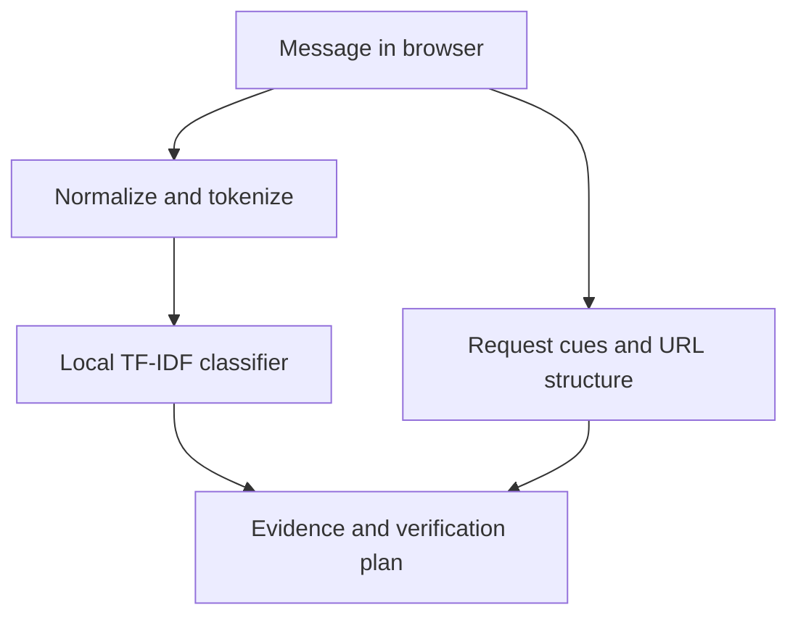

# SecondLook

**Check before you click.** A private second look at suspicious messages, built for ForgeHacks Online 2026, **AI + Cybersecurity**.

SecondLook helps students and everyday readers pause before acting on a convincing text or email. A trained browser-based classifier, observable request cues, and link-structure checks explain what deserves attention. The result always leads to independent verification, never a “safe” verdict.

## Try it

Open the deployed app, select **Scholarship fee**, and choose **Check this message**. Review the payment, urgency, and secrecy cues; expand the model evidence; then open the verification guide. Compare **Study group**: fewer cues still does not verify the sender.

[Open SecondLook](https://secondlook-forgehacks.vercel.app/) · [Public source](https://github.com/adeelfalaksher900-creator/secondlook-forgehacks). Demo status and publication receipts are recorded in `docs/publishing.json`.

## Run locally

Requires Python 3 and Node.js 22+ for tests. No backend, account, API key, or paid AI service.

```sh
python -m http.server 4186 --directory public
```

Open http://localhost:4186. The included model is ready to use. `npm test` checks JavaScript inference against every held-out Python prediction.

## Actual AI, not a hosted API wrapper

- Dataset: [UCI SMS Spam Collection](https://archive.ics.uci.edu/dataset/228/sms%2Bspam%2Bcollection), Almeida & Hidalgo (2011), DOI [10.24432/C5CC84](https://doi.org/10.24432/C5CC84), **CC BY 4.0**.
- 5,574 source rows → 5,126 unique normalized messages, deduplicated **before** splitting.
- Stratified 80/20 split, seed 42; 4,100 training / 1,026 test messages.
- TF-IDF word unigrams and bigrams, minimum document frequency 2, sublinear TF, L2 normalization; 9,819 learned features.
- Logistic regression, C=8. Parameters and vocabulary exported to `public/model.json`.
- JavaScript implements identical preprocessing and inference locally. Every held-out probability matches Python within 1e-10.
- Explanations show the largest positive linear feature contributions. Separate deterministic cues inspect money, access codes, pressure, rewards, secrecy, and URL structure.
- Short, unfamiliar, and detected non-English messages receive a context limitation notice and no model score. This is a heuristic scope check, not reliable language identification.

## Evaluation

Measured on the held-out **historical SMS spam** dataset at threshold 0.5:

| Metric | Result |
|---|---:|
| Spam precision | 97.17% |
| Spam recall | 81.75% |
| Spam F1 | 88.79% |
| Average precision | 97.19% |
| Brier score | 0.01814 |
| True negatives / false positives | 897 / 3 |
| False negatives / true positives | 23 / 103 |

Full metadata, hash, and limitations: `docs/evaluation.json`. These are classifier metrics, **not** a measurement of the combined triage workflow or real-world fraud prevention. No claim is made about modern phishing accuracy, identity verification, or AI-content detection. Near-duplicate templates may remain across splits. Test-set distributions differ from incoming emails or modern scams.

## Reproduce training

```sh
python -m pip install -r ml/requirements.txt
curl -L 'https://archive.ics.uci.edu/static/public/228/sms%2Bspam%2Bcollection.zip' -o ml/sms.zip
python ml/train.py
npm test
```

Training regenerates the model, metrics, and parity fixtures. Raw messages are not committed as a separate dataset. Parity fixtures contain public dataset examples and retain their CC BY 4.0 attribution.

## Architecture



Training occurs offline in Python. Runtime requests only local static assets. Suspicious URLs are never fetched. Output text uses DOM textContent, not HTML injection. No third-party analytics, cookies, browser storage, telemetry, inference calls, or remote message persistence. The host still receives ordinary page/asset requests; browser extensions and the device remain outside this app's privacy boundary.

## Accessibility and testing

Keyboard controls, named message input, live result region, mobile layout, reduced-motion support, visible focus rings, and semantic headings. Four states tested with axe-core WCAG 2.0/2.1 AA tags: no automated violations; not a claim of complete accessibility certification. Behavior and XSS checks are in `tests/browser.cjs`; evidence is in `docs/`.

## Team and AI assistance

Assigned responsibilities: **Adeel Falak Sher** — product direction, user flow, frontend and presentation. **Rauf Khalid** — ML evaluation, security review and demo verification. Implementation and documentation were AI-assisted. These responsibility assignments do not represent independently verified past contributions.

## Impact and next steps

The shipped value is a low-friction private way to inspect a request and decide how to verify it. We have not run a user study or measured money saved. Next: consented usability tests, a modern independently labeled scam dataset, near-duplicate grouped evaluation, multilingual models, and measured false-alarm rates.

## License

Project code: MIT (`LICENSE`). Dataset-derived fixtures: CC BY 4.0, attribution above. Third-party tooling licenses and media provenance: `docs/third-party.md`.

Browser development checks require `npm install` and `npx playwright install chromium`. Run checks and capture scripts from the repository root while the local server is running. Set `SECONDLOOK_BROWSER_PATH` only when using a custom Chromium executable. Automated axe checks need the project development dependencies.
